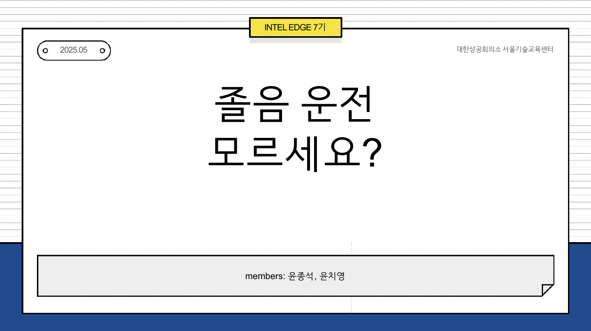
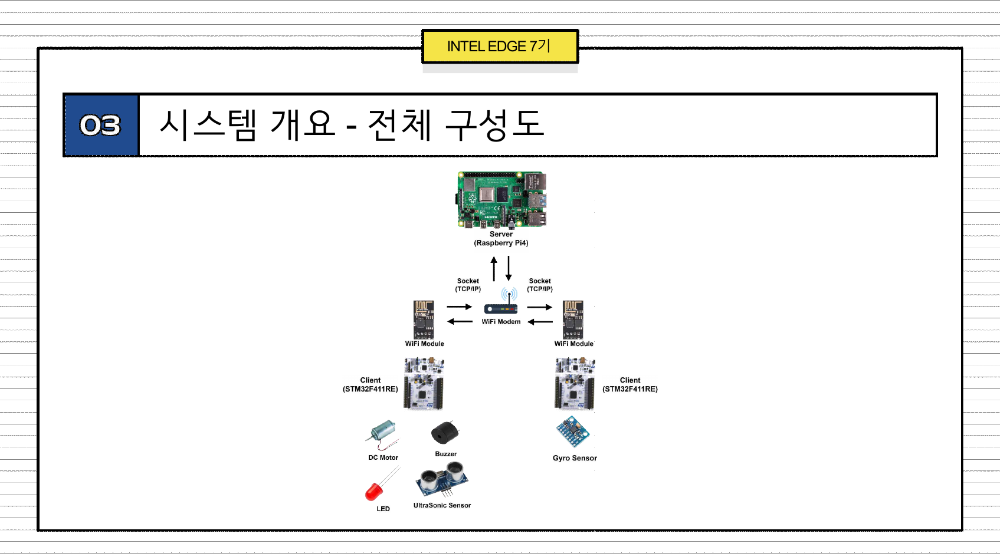
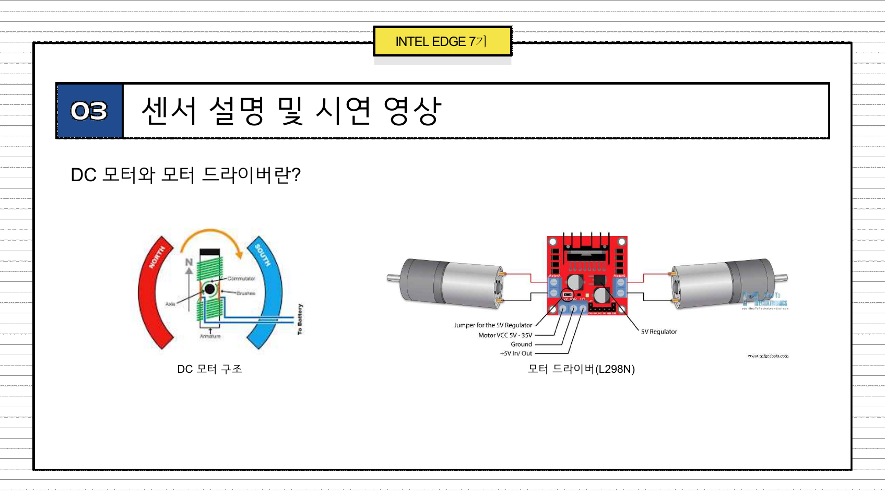
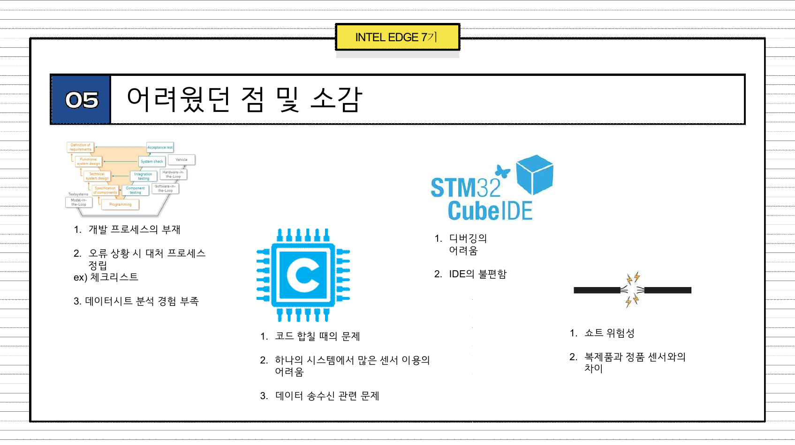
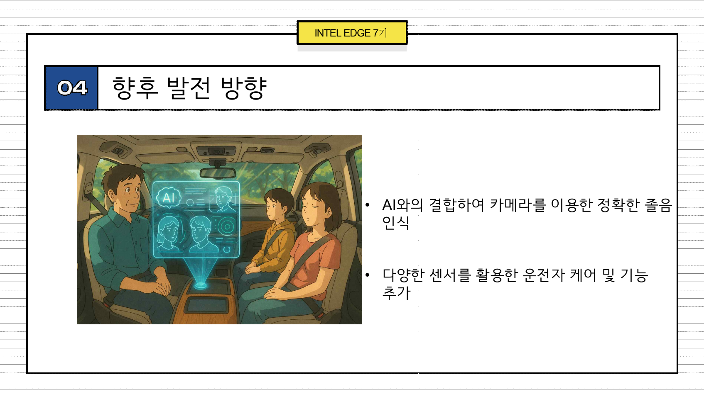

# 졸음 운전 모르시나요?

INTEL EDGE 7기 · 센서·임베디드 기반 졸음 운전 감지/대응 프로젝트

## 한 줄 소개
- 운전자의 고개 끄덕임(피치 변화)을 실시간 감지하고, 서버·네트워크·액추에이터를 연동해 위험을 알리고 대응하는 임베디드 IoT 프로젝트입니다.

## 왜 만들었나 (Background)
- 졸음 운전은 매년 수천 건의 사고로 이어지는 사회 문제입니다.
- 실습 중심으로 “센서→판단→네트워크→대응”의 전 과정을 구현하여, 실제로 동작하는 예방 시나리오를 제시했습니다.

## 무엇을 만들었나 (Overview)
- 두 개의 STM32 보드가 역할을 분담합니다.
  - 자이로 보드: MPU6050 데이터를 바탕으로 머리의 피치 변화(끄덕임)를 계산, 임계치 초과 시 위험 상태를 전송. `src/stm32_gyro_test/Core/Src/main.c`
  - 액추에이터 보드: 서버 지시를 수신하면 부저·LED·서보·DC 모터·초음파 센서를 제어/표시. `src/stm32_mini_project_v4/Core/Src/main.c`
- 네트워크는 ESP8266(AT 명령) + TCP 소켓 서버로 구성되며, 간단한 메시지 프로토콜로 상태를 주고받습니다.

## 시스템 구성 (Architecture)
- 통신 서버: 다중 클라이언트 TCP 라우팅, 단순 인증. `src/iot_socket/iot_server.c`
- 리눅스 클라이언트: 주기 질의 및 제어 메시지 브로킹. `src/iot_socket/client_linux.c`
- DB 클라이언트(옵션): MySQL과 연동해 상태를 저장/조회. `src/iot_socket/iot_client_device.c`
- 무선 통신: ESP8266 AT 명령으로 TCP 연결/송수신. `src/stm32_mini_project_v4/Core/Src/esp.c`, `src/stm32_mini_project_v4/Core/Inc/esp.h`

## 핵심 아이디어 (How It Works)
1) MPU6050에서 가속도·각속도를 읽어 보정 필터(Complementary Filter)로 피치/롤을 추정합니다.
2) 일정 시간(예: 1초) 이상 피치가 임계(약 30°)를 초과하면 졸음으로 판단합니다.
3) 상태 변화는 `[수신자]명령@인자` 형태의 간단한 텍스트 프로토콜로 서버에 전달됩니다.
4) 서버는 대상 클라이언트에 메시지를 라우팅하고, 액추에이터 보드가 경고·표시를 수행합니다.

## 하드웨어 & 센서/액추에이터
- MCU: STM32F411RE (CubeIDE 프로젝트)
- 센서: MPU6050 자이로/가속도, 초음파 2채널 (거리 표기)
- 액추에이터: 부저, LED, 서보 모터, DC 모터(L298N 드라이버)

## 메시지 디자인 (Message Design)
- 로그인: `[ID:PASSWD]` (서버가 `src/iot_socket/idpasswd.txt`로 인증)
- 예시 메시지
  - 자이로 → DB: `[CHI_SQL]SETDB@status@ON\n`
  - 리눅스 → 액추에이터: `[CHI_STM2]DETECT@ON\n`
  - 액추에이터 → 응답: `[CHI_STM2]DETECT@ON\n`

> 목적은 “가독성 높은 텍스트 프로토콜”을 통해 다양한 노드가 손쉽게 상호작용하도록 하는 것입니다.

## 데모 시나리오 (Storyboard)
- 운전자의 머리가 반복적으로 앞으로 숙여지면(피치↑) 자이로 보드가 졸음을 감지합니다.
- 위험 신호가 서버로 전달되고, 액추에이터 보드가 부저/LED/모터를 통해 경고합니다.
- 보조 클라이언트/DB가 상태를 기록하여 추후 분석이 가능합니다.

### 시연 영상

[유튜브에서 보기](https://youtu.be/sqs7I7DL4iY)

## 결과와 인사이트 (Outcome)
- 실제 하드웨어·네트워크 루프를 끝까지 엮어 “작동하는” 졸음 경고 체인을 완성했습니다.
- 텍스트 기반 메시지 체계로 센서/디바이스/애플리케이션 간 결합도를 낮추고 확장성을 확보했습니다.

## 배운 점 & 어려웠던 점 (Lessons)
- STM32CubeIDE 디버깅/코드 합치기의 난이도, 전원/배선 이슈, 여러 센서의 동시 운용에서의 간섭 처리.
- 네트워크 타임아웃·재접속·간헐 신호 손실에 대비한 상태 머신 설계의 중요성.

## 앞으로의 방향 (Roadmap)
- 카메라/AI 융합으로 더 정밀한 졸음 인식(표정·눈 깜빡임 등)과 다중 센서 융합.
- 운전자 케어 기능 확장(진동 시트, HMI 연동, 주행 데이터 시각화 등).

## 리포지토리 맵 (Repository Map)
- `ppt/윤종석,윤치영_졸음_모르시나요.pdf` — 발표 자료 원본
- `docs/ppt_images/` — README에서 사용하는 슬라이드 이미지
- `src/stm32_mini_project_v4/` — 액추에이터 보드 펌웨어
- `src/stm32_gyro_test/` — 자이로 보드 펌웨어
- `src/iot_socket/` — 소켓 서버·클라이언트·DB 클라이언트

## 팀
- members: 윤종석, 윤치영

## 고지
- 본 프로젝트는 교육/데모 목적이며 실제 차량 적용 시 별도의 안전 설계와 검증이 필요합니다.
